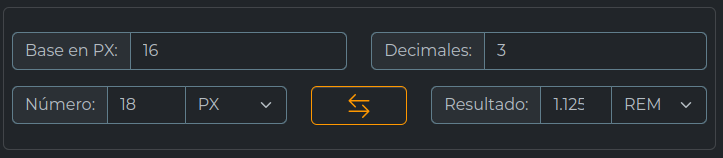
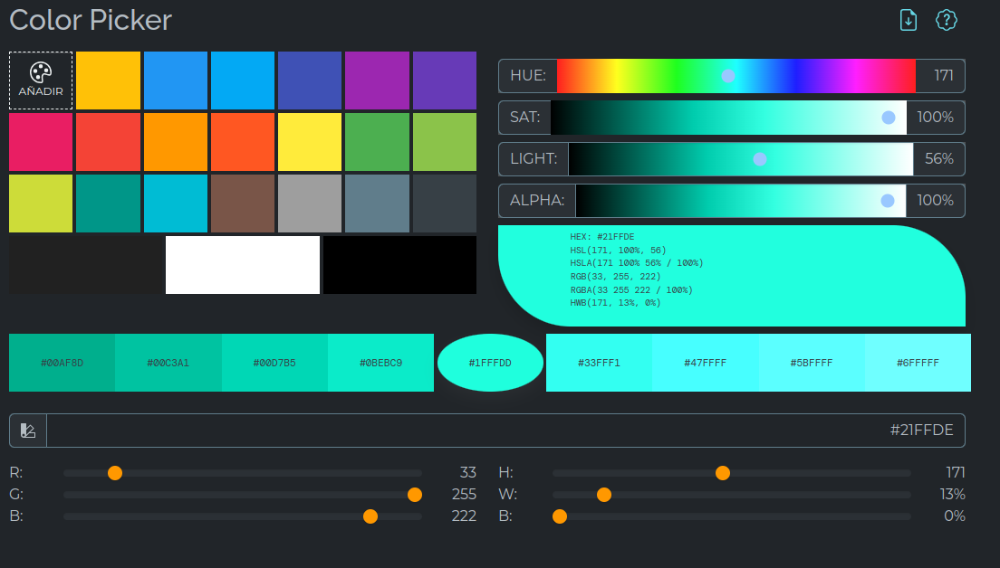

# Helpers CSS

Herramienta para desarrolladores Front-End

## Calculadora CSS

Helper Css ofrece una forma simple de calcular las medidas CSS en ella podemos convetir las unidades.

Su uso es muy sencillo solo debemos establecer una base de calculo por defecto para `rem` o `em` es `16`, luego el número que deseamos calcular y por ultimo me dida del numero el resultado lo veran el la siguiente campo, tambien podemos especicar la cantidad de decimales que deamos optener, por defecto su valor es `3`. 

### Lista de Unidades Soportadas

- PX (Pixel)
- % (Porcentaje)
- REM
- EM
- CM (Centimetro)
- MM (Milimetro)
- IN (Pulgada)
- PT (Punto)
- PC (Picas)
- LH (Altura de Linea `line-height`)
- VH (Wiewport Height)
- VW (Wiewport Width)

## Color Picker CSS

Helpers Css hace uso de las utilidades de color de [FascinoJs](https://github.com/REP98/fascino) para permitir la conversion de colores y poder dar colores en distinto formatos, además muestra un cuadro de colores basados en colores de [Material Desing](https://www.materialpalette.com/), tambien genera una paleta gama de color seleccionado y permite añadir sus propos colores para su posterior uso.

> En el icono de descargar archivo en la parte superior derecha puede descargar el codigo generado de la paletas de colores

### Formatos de Colores

El soporte de colores generados por esta herramientas son:
- HSL( Hue, Saturación (`Saturate`), Iluminación(`Light`) ) y HSLA(HSL con canal Alfa)
- HWB( Hue, Blanco(`White`), Negro(`black`) )
- RGB (Red, Green, Blue) y (RGB con canal Alfa)
- HEXADECIMAL y con canal Alfa

## Origen
Helpers Css fue desarrollador orignalmente en Python puede ver su repositorio [Aqui](https://github.com/REP98/calCss) se migro a este desarrollo con la intencion de mejorar y ofrecer un ambiente mas simple como WebApp Hibrida para una mejor compativilidad con los diversos Sistemas Operativos.

## Sistemas Operativos
Helpers CSS es soportado por los siguientes sistemas operativos.
- Android apartir de su versión 8
- Window 32bit y 64bit
- Linux 64bit
- Browser desde [GitHub](rep98.github.io/helperscssmos)

## Legal
Este proyecto esta bajo la licensia [LICENSE](MIT).